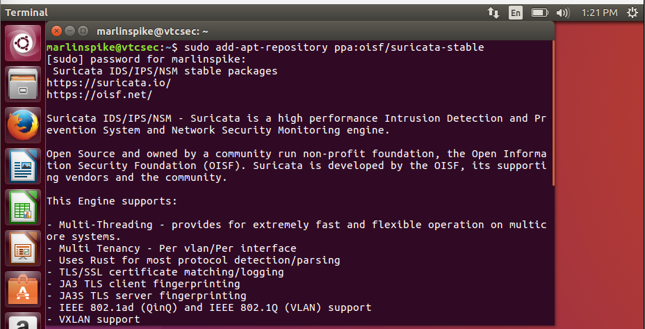
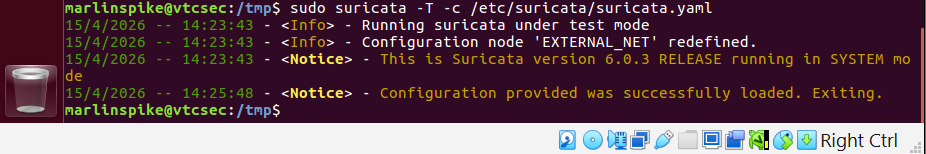

# Suricata + Wazuh Integration Lab

## Objective
Integrate Suricata, a Network-based Intrusion Detection System (NIDS), with Wazuh to enhance threat detection by monitoring and analyzing network traffic in real time.

## Tools Used
- Suricata 6.0.3
- Wazuh
- Ubuntu (endpoint)
- Kali Linux (Wazuh server)
- VirtualBox

## Scenario
Intel comes in that someone is probing the Ubuntu server. Suricata catches the first packet, matches it against detection rules and writes the alert to a log file. Wazuh picks it up and displays it on the SOC dashboard for the analyst to investigate.

---

## Steps

### 1. Install Suricata

```bash
sudo add-apt-repository ppa:oisf/suricata-stable
sudo apt-get update
sudo apt-get install suricata -y
suricata -V
```




---

### 2. Download and Apply Emerging Threats Ruleset

```bash
cd /tmp/
curl -LO https://rules.emergingthreats.net/open/suricata-6.0.8/emerging.rules.tar.gz
sudo tar -xvzf emerging.rules.tar.gz
sudo mkdir -p /etc/suricata/rules
sudo mv rules/*.rules /etc/suricata/rules/
```



---

### 3. Configure Suricata

Modified `/etc/suricata/suricata.yaml` with the following changes:
- Set `HOME_NET` to the Ubuntu endpoint IP
- Configured the network interface (`enp0s3`) for packet capture
- Enabled `modbus` and `dnp3` protocols so all rules load without errors

Verify the config:
```bash
sudo suricata -T -c /etc/suricata/suricata.yaml
```

---

### 4. Connect Wazuh to Suricata Logs

Added a `localfile` block to `/var/ossec/etc/ossec.conf` pointing to Suricata's `eve.json` log file so the Wazuh agent reads and forwards alerts in real time.

```xml
<localfile>
  <log_format>json</log_format>
  <location>/var/log/suricata/eve.json</location>
</localfile>
```

Restart Wazuh agent:
```bash
sudo systemctl restart wazuh-agent
```

---

### 5. Attack Emulation

Pinged the Ubuntu endpoint from the Wazuh server to generate ICMP traffic and trigger a Suricata detection.

```bash
ping -c 20 <Ubuntu_IP>
```

---

### 6. Verify Alerts on Wazuh Dashboard

Navigated to **Threat Hunting** on the Wazuh dashboard and confirmed ICMP ping alerts were visible.


---

## Result

Suricata successfully detected the emulated attack and forwarded the alert to Wazuh. The full pipeline — traffic in, NIDS detects, SIEM surfaces, analyst investigates — was built and tested end to end.

---

## Analyst
**Nwabueze Benita**  
[GitHub](https://github.com/IAMBENITA) | [LinkedIn](https://linkedin.com/in/benitanwabueze)
