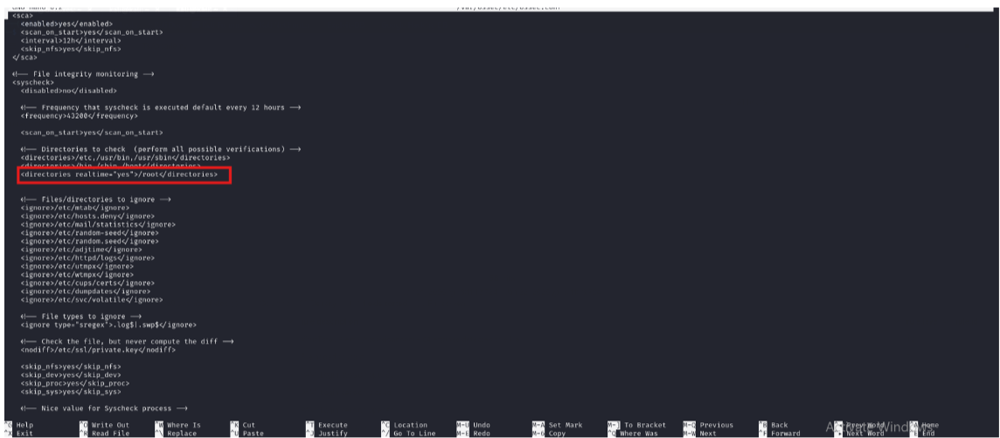
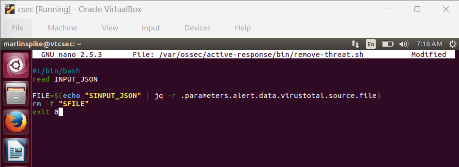
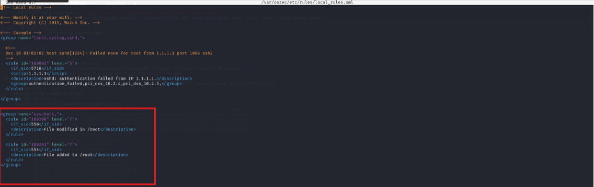
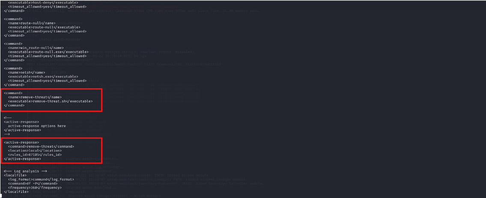
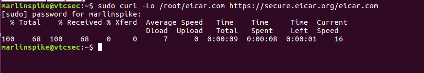
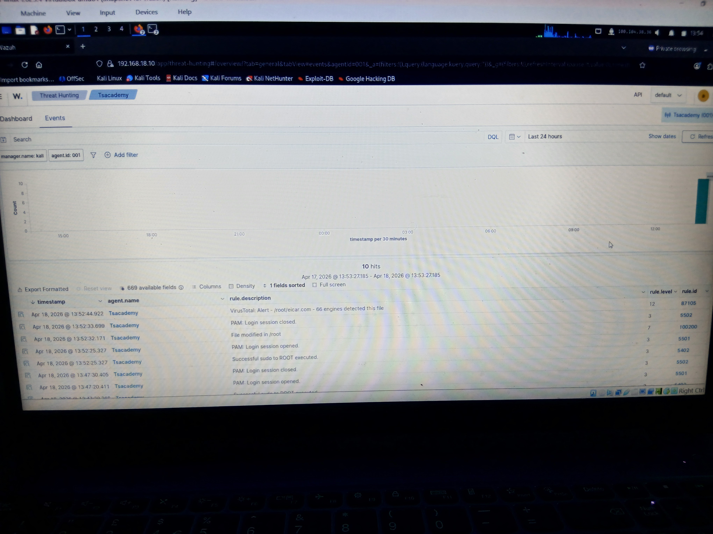

# Wazuh + VirusTotal Integration Lab

## Overview

This lab documents the integration of Wazuh with VirusTotal to build an automated malware detection and response pipeline.

The moment a malicious file touches the monitored endpoint, Wazuh catches it, VirusTotal confirms it and the file is deleted automatically — no manual intervention required.

---

## Tools Used

- Wazuh SIEM
- VirusTotal API
- EICAR Test File
- Ubuntu (endpoint)
- Kali Linux (server)

---

## How It Works

1. Wazuh monitors the `/root` directory on the Ubuntu endpoint in real time via syscheck
2. When a file is added or modified, Wazuh grabs the file hash and sends it to VirusTotal via API
3. If VirusTotal flags it as malicious (rule 87105 triggers), the active response playbook runs
4. The playbook (`remove-threat.sh`) deletes the file automatically

---

## Lab Walkthrough

### Part 1 — Ubuntu Agent Configuration

**Step A1 — Enable real-time monitoring of /root**

Edited `/var/ossec/etc/ossec.conf` and added the following inside the existing `<syscheck>` block:

```xml
<directories realtime="yes">/root</directories>
```


**Step A2 — Create the active response playbook**

Created `/var/ossec/active-response/bin/remove-threat.sh`:

```bash
#!/bin/bash
read INPUT_JSON
FILE=$(echo "$INPUT_JSON" | jq -r .parameters.alert.data.virustotal.source.file)
rm -f "$FILE"
exit 0
```


**Step A3 — Set correct permissions**

```bash
sudo chmod 750 /var/ossec/active-response/bin/remove-threat.sh
sudo chown root:wazuh /var/ossec/active-response/bin/remove-threat.sh
```

**Step A4 — Restart the agent**

```bash
sudo systemctl restart wazuh-agent
```

---

### Part 2 — Wazuh Server Configuration (Kali)

**Step 1 — Add custom detection rules**

Edited `/var/ossec/etc/rules/local_rules.xml` and added:

```xml
<group name="syscheck,">
  <rule id="100200" level="7">
    <if_sid>550</if_sid>
    <description>File modified in /root</description>
  </rule>

  <rule id="100201" level="7">
    <if_sid>554</if_sid>
    <description>File added to /root</description>
  </rule>
</group>
```


**Step 2 — Configure VirusTotal integration**

Added to `/var/ossec/etc/ossec.conf`:

```xml
<integration>
  <name>virustotal</name>
  <api_key>YOUR_VT_API_KEY</api_key>
  <rule_id>100200,100201</rule_id>
  <alert_format>json</alert_format>
</integration>
```

This tells Wazuh to send file hashes from rules 100200 and 100201 to VirusTotal.

**Step 3 — Define the command and active response trigger**

Also in `ossec.conf`:

```xml
<command>
  <name>remove-threat</name>
  <executable>remove-threat.sh</executable>
</command>

<active-response>
  <command>remove-threat</command>
  <location>local</location>
  <rules_id>87105</rules_id>
</active-response>
```

> **Note:** `<command>` entries must appear **before** `<active-response>` entries in the config file. Wrong order will prevent the Wazuh Manager from starting.



**Step 4 — Restart the Wazuh manager**

```bash
sudo systemctl restart wazuh-manager
```

---

### Part 3 — Testing

Installed curl on Ubuntu and downloaded the EICAR test file (a harmless, industry-standard fake malware file):

```bash
sudo apt install curl
sudo curl -Lo /root/eicar.com https://secure.eicar.org/eicar.com
```



**Expected result:**
- File appears in /root ✔
- Wazuh detects it via syscheck ✔
- VirusTotal flags it (66 engines detected this file) ✔
- File is deleted automatically ✔

**Dashboard evidence:**



---

## Error Encountered & Fixed

### Ubuntu agent showed as disconnected

**Symptom:** Agent appeared in the Wazuh dashboard but showed as disconnected despite the agent service running fine on Ubuntu.

**Cause:** Kali runs a dynamic IP address. The IP had changed since the agent was first enrolled, so the address in the agent's `ossec.conf` no longer matched.

**Fix:** Ran `ip a` on Kali to get the current IP, updated the `<address>` field in `/var/ossec/etc/ossec.conf` on Ubuntu, restarted the agent.

> **Real SOC note:** In a production environment, dynamic IPs on monitoring infrastructure are avoided entirely. Servers running Wazuh managers are assigned static IPs or resolved via internal DNS — because a disconnected agent is a blind spot.

---

## Key Concepts Demonstrated

- **Threat Intelligence Integration** — VirusTotal API connected to Wazuh
- **Active Response / SOAR** — automated file deletion on malware confirmation
- **Custom Rule Writing** — local_rules.xml with syscheck parent SIDs
- **Log Analysis** — reading error logs to diagnose manager startup failures
- **Agent-Manager Connectivity** — diagnosing and fixing address mismatches

---

*Follow my learning journey on [LinkedIn](https://linkedin.com/in/benitanwabueze) and [X](https://x.com/Ogechee_).*
